# 英文字典生成器(Dictionary)

## 1.软件信息

名称:英文字典生成器

版本:beta版

功能:从英文文本中提取英文单词并生成字典

系统要求:Window10 x64

作者:薛辰立(Jerry_Xue)

联系方式:QQ-1716177017

## 2.功能介绍

### 2.1.主页面

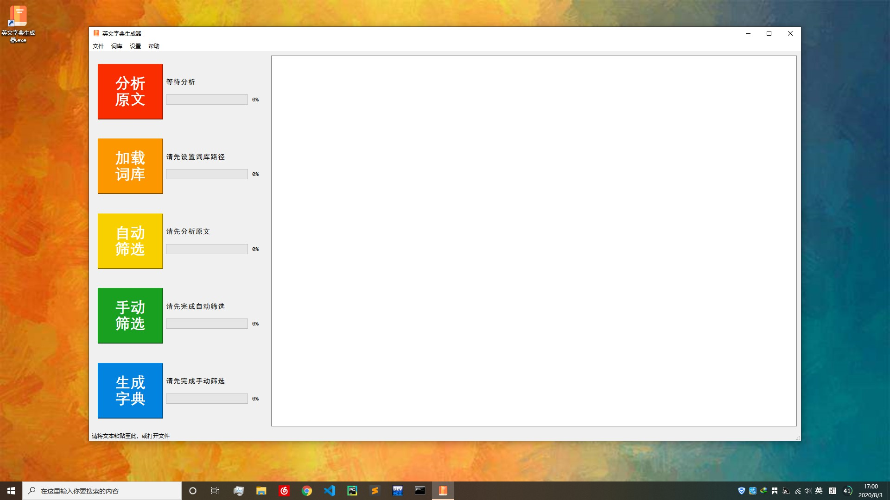

主页面由左侧5个按钮及其配套标签、进度条和右侧的文本框组成，该窗口支持缩放。

#### 2.1.1分析原文

**功能:**对文本框内的文字进行分析，并将分析结果显示在文本框中

**效果:**将原文中的所有英文单词提取出来并统一为小写字符；开启"简化"后将对单词进行简化，但会减慢分析速度

**展示:**

分析前:

分析中:

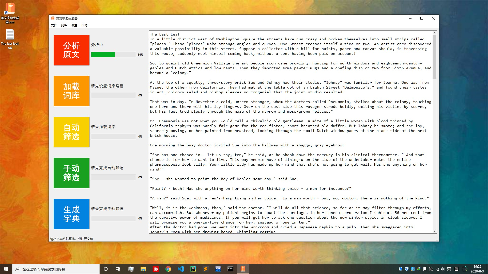

分析后:

#### 2.1.2加载词库

**功能:**加载.pkl文件中的词库，用于自动筛选

**展示:**

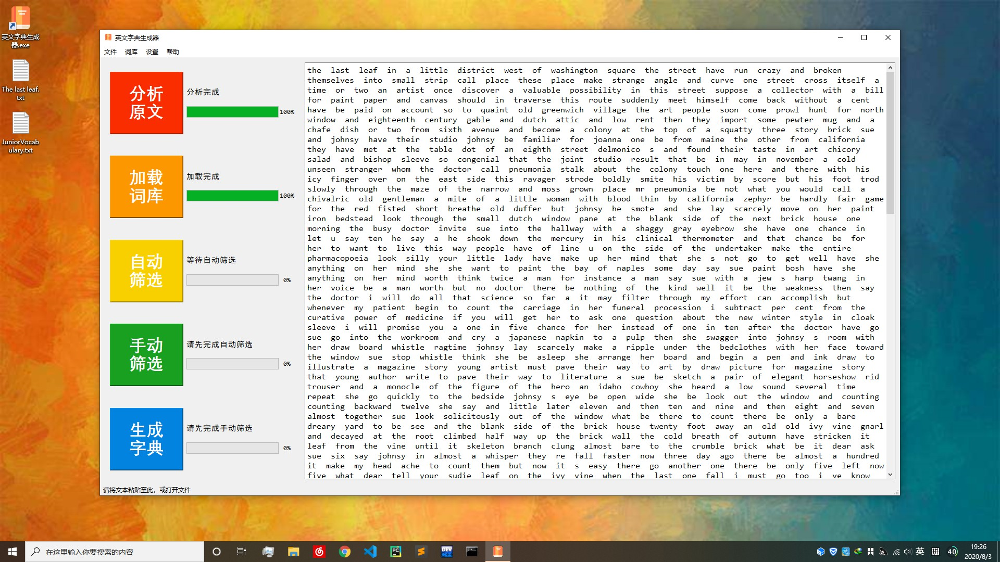

#### 2.1.3自动筛选

**功能:**在分析的结果中进行去重操作，并筛去已加载词库中的单词

**展示:**

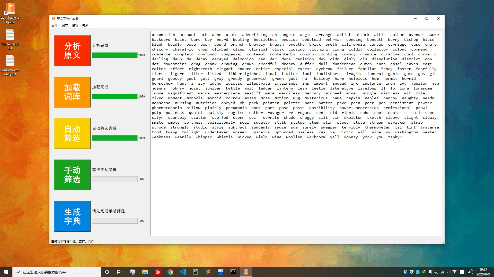

#### 2.1.4手动筛选

**功能:**在自动筛选的结果中手动进行更为精细化的筛选

此功能又分为两种模式:逐个模式和批量模式，默认使用批量模式

##### 2.1.4.1逐个手筛模式

**效果:**将单词逐个以小窗口的形式呈现，并在呈现同时朗读该单词

**操作方法:**鼠标点击Y按钮时将去除该单词，点击N按钮时将保留该单词；在键盘上按下Y键、在窗口上单击鼠标左键与点击Y按钮作用相同，在键盘上按下N键、在窗口上单击鼠标右键或直接关闭窗口与点击N按钮作用相同。单击主界面并按下F5可强制结束筛选；不支持暂停

**选择建议:**在单词较少、视力疲劳、训练手速或消遣时间时可以尝试此模式。朗读音量较小，建议将系统音量调至最大

**展示:**

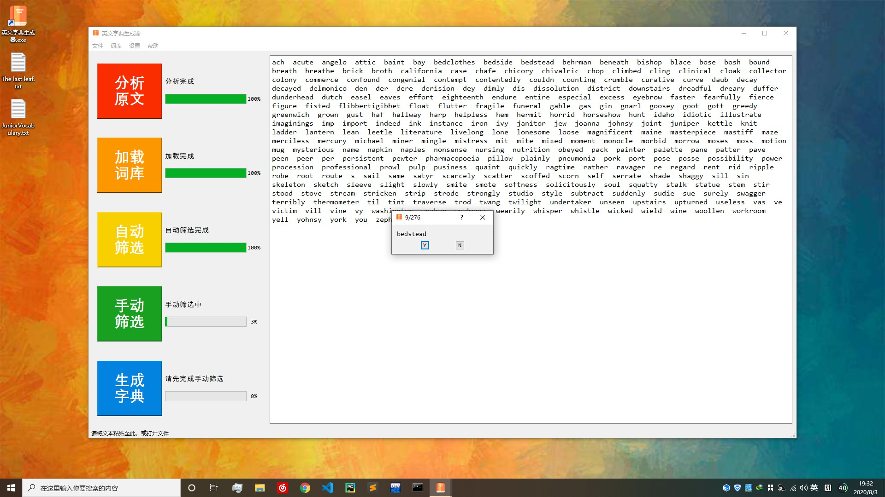

##### 2.1.4.2批量手筛模式

**功能:**将待筛选单词以列表形式呈现

**操作方法:**勾选出需要去除的单词，按下关闭键以保存

**选择建议:**单词较多时可以进行较为快速的筛选

**展示:**

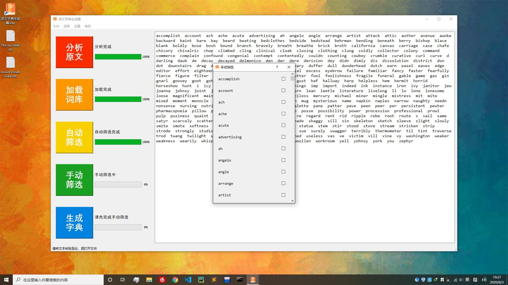

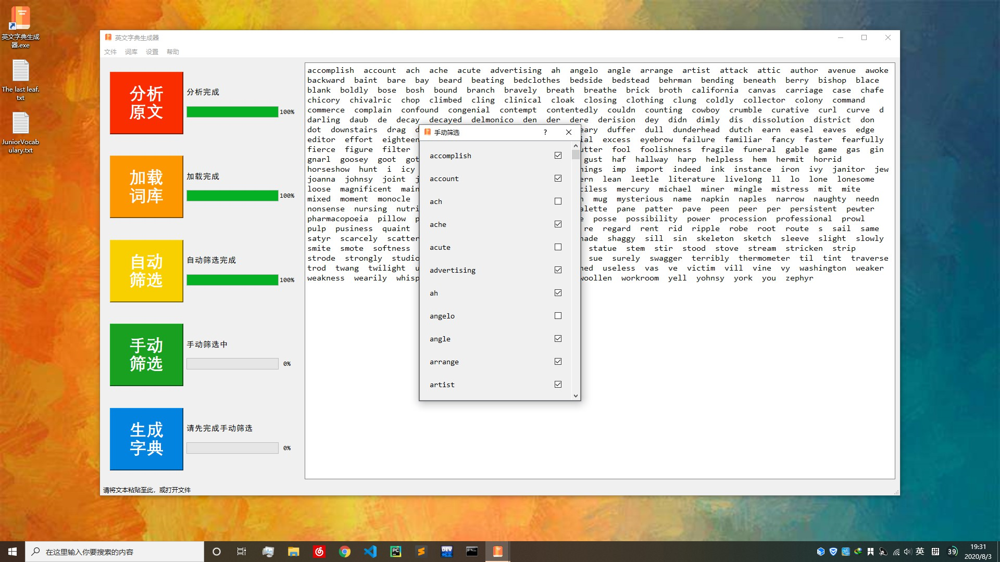

筛选后:

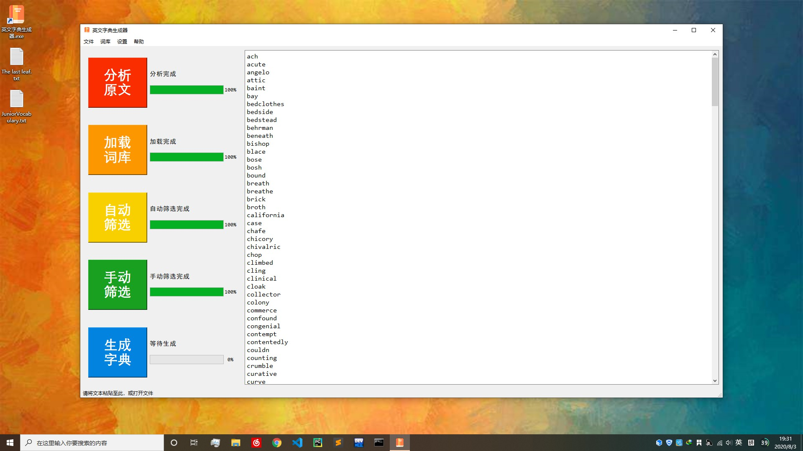

#### 2.1.5生成字典

**功能:**将筛选出的单词编制为字典，在编制字典前可以选择是否进行检查

此功能又分为两种模式:无页码模式和有页码模式，默认使用无页码模式

##### 2.1.5.1生成字典前检查

**功能:**检查筛选出的单词是否能查询到音标和词义，检查后生成字典速度会大幅提升

**效果:**检查完成后在文本框显示出没有音标或词义的单词；可点击手动筛选进行再次处理。如果未查询到词义，则可能拼写有误或为专有名词、古英语、偏僻词等在线词典未收录单词；如果未查询到音标，则可能需将单词调整为原级(可尝试打开"简化"开关重新分析这些单词)

**展示:**

检查中:

检查结果:

处理检查结果:

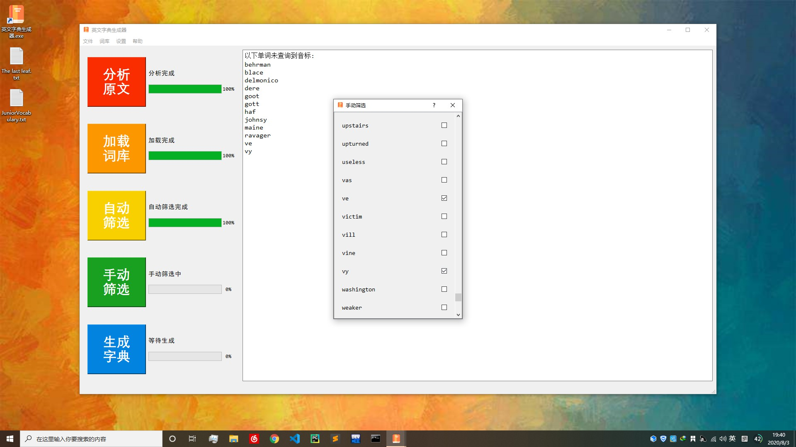

##### 2.1.5.2无页码生成模式

**功能:**将筛选出的单词制作为字典(不包括目录，页码和每页单词范围)

**效果:**生成一个.docx文档至输出路径

**选择建议:**当对字典要求不高、对生成速度要求较高或电脑未安装自带Word软件时建议选择

**展示:**

制作中:

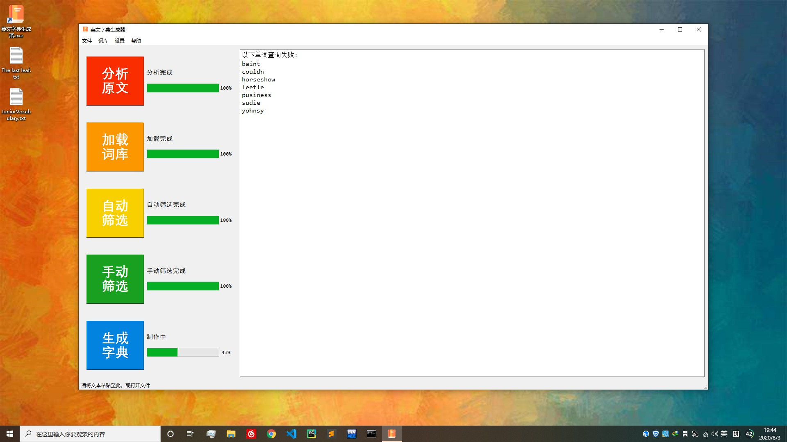

制作完成:

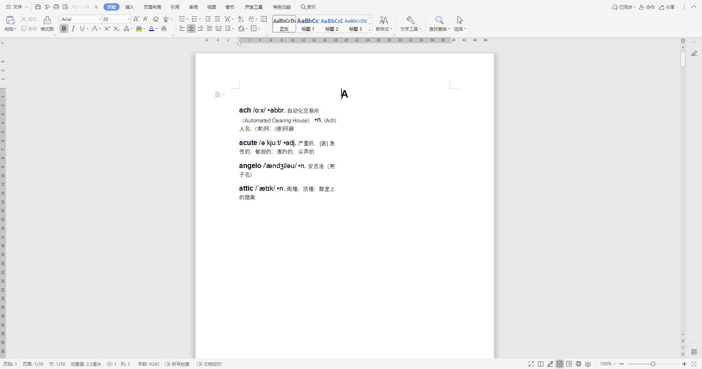

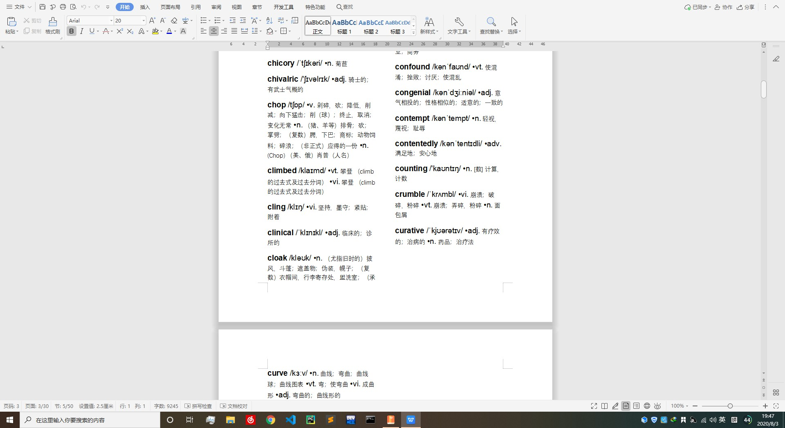

##### 2.1.5.3有页码生成模式

**功能:**将筛选出的单词制作为一本较为完整的字典

**效果:**生成一个.docx文档，一个.pdf文档至输出路径

**选择建议:**当追求完美、时间充裕时可以使用，但注意生成过程中请不要点击屏幕。制作过程中会调用系统自带Word进行辅助，若不慎点击屏幕，请将激活向导、欢迎界面关闭，但不要关闭Word程序，字典能够正常制作，但是屏幕会出现闪烁而引发不适

**展示:**

制作前提示:

页码添加:

制作完成:

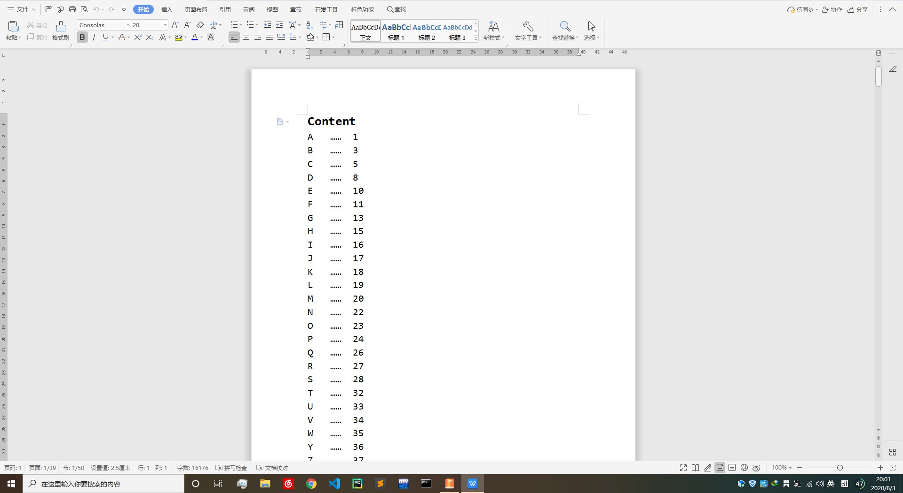

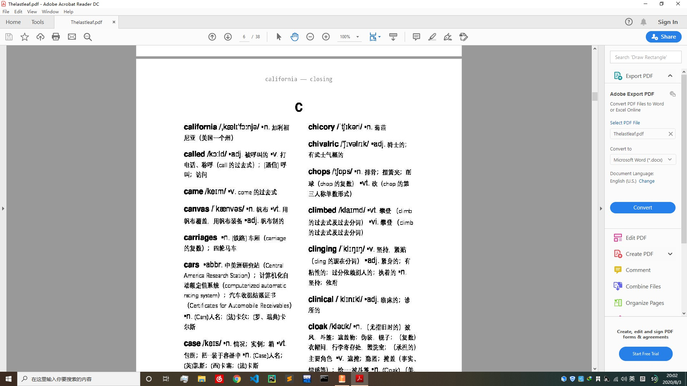

目前，该功能仍存在以下瑕疵:

每页单词范围存在差错:制作过程中写入段落时默认会在段前插入空行而干扰检测，故每个单词从单词词条前的空行开始计算起始

瑕疵示例:

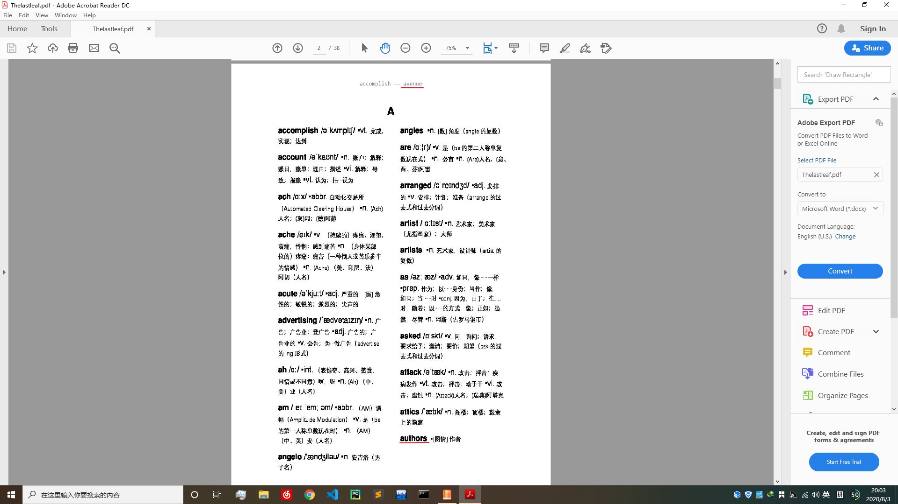

### 2.2菜单栏

菜单栏位于主页面的顶端，共由4个标签组成

#### 2.2.1文件

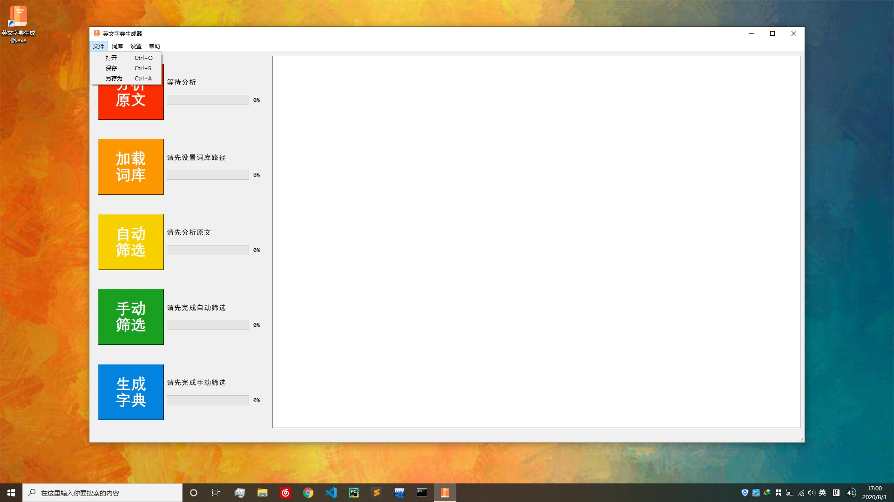

文件菜单包含打开，保存，另存为三个选项，快捷键依次为Ctrl+O,Ctrl+S,Ctrl+A

##### 2.2.1.1打开文件

**功能:**打开指定位置的.txt文件

**效果:**将文件内容显示在文本框中

**展示:**

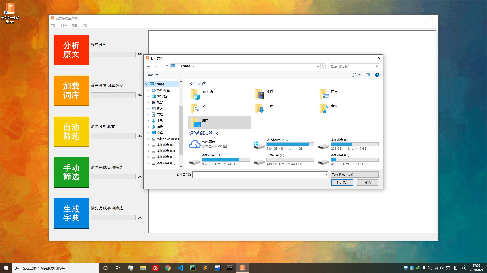

##### 2.2.1.2保存文件

**功能:**将文本框中的文字保存到指定文件中

**效果:**若文本由文件打开，则将该文本保存至该文件中；否则效果同另存为

**展示**:

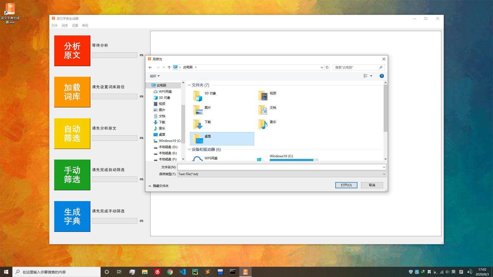

##### 2.2.1.3文件另存为

**功能:**将文本框中的文字保存到指定文件中

**效果:**新建一个文件并将文本存入该文件中

#### 2.2.2词库

词库菜单包含新建，合并两个选项，快捷键依次为Ctrl+N,Ctrl+U

##### 2.2.2.1新建词库

**功能:**将给定文本制为词库

**效果:**对给定文本进行分析，并将分析结果制为词库

**展示:**

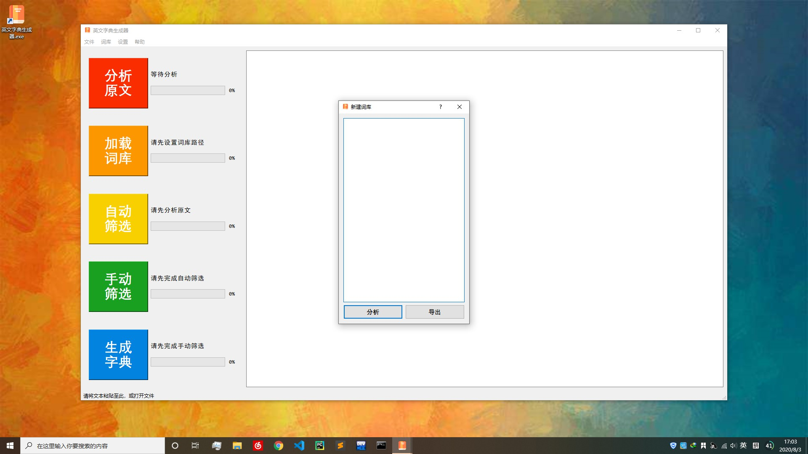

##### 2.2.2.2合并词库

**功能:**将指定的两个词库合并

**效果:**生成一个包含两个词库中单词的新词库文件

**展示:**

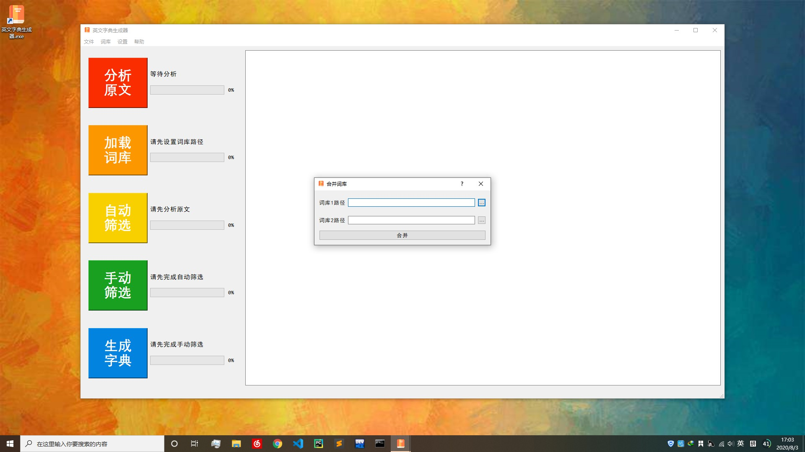

#### 2.2.3设置

设置菜单包含路径，模式两个选项，快捷键依次为Ctrl+P,Ctrl+M

##### 2.2.3.1路径设置

**功能:**设置词库路径，输出路径以及需要加载的配置路径

**效果:**设置词库路径后即可加载词库，当词库路径更换时需要重新加载词库、重新筛选；设置输出路径后方可进行字典制作；配置路径默认为程序所在文件夹中的Resources目录下的settings.pkl文件，若更换配置路径，则会从指定的新路径中读取配置(在此窗口中设置的词库路径与输出路径会覆盖原有的配置)，并将配置转存至默认存储位置

**展示:**

##### 2.2.3.2模式设置

**功能:**设置制作过程中的一些模式选择

**效果:**打开简化后，所有的分析操作(包括分析原文和新建词库时的分析)都会对原文进行简化，所谓简化就是尽量将单词的变形(如-ing -s/es -ed)等去除，便于提高自动筛选的效率；手动筛选模式可以在此处设置，效果参见上文2.1.4手动筛选；生成字典前检查可以在此处开启，效果参见上文2.1.5.1生成字典前检查；页眉页脚设置的是生成字典时的有无页码的模式，效果参见上文2.1.5.2无页码生成模式，2.1.5.3有页码生成模式。默认设置为关闭简化、检查与页眉页脚添加，使用批量模式进行手动筛选

**展示:**

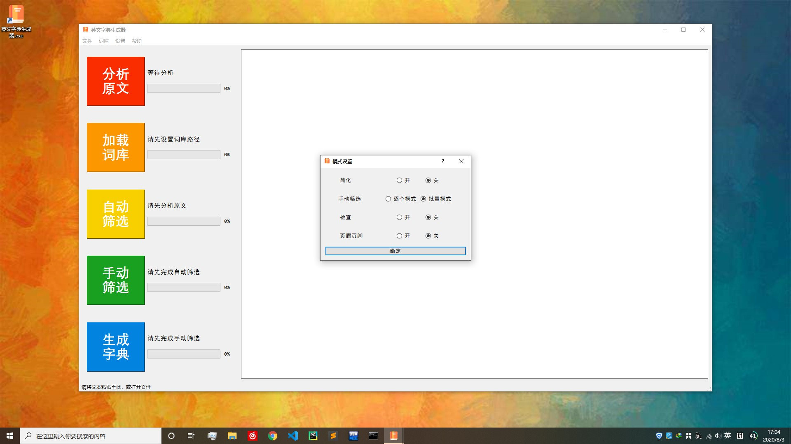

#### 2.2.4帮助

帮助菜单包含查看帮助文档一个选项，快捷键为Ctrl+H

##### 2.2.4.1查看帮助文档

**功能:**用于帮助文档的查看

**效果:**打开位于程序所在文件夹中的Resources目录下的helper.html，即本文档

### 2.3状态栏

状态栏位于主页面的底部，在鼠标悬停在主页面控件上时显示相关信息提示

## 3.使用教程

在本教程中，我们将为O.Henry的短篇小说The last leaf制作一本专属字典。

使用到的相关资料将存放在程序所在文件夹中的Resources/Sample目录中

### 3.1首次使用设置

首次使用时，软件会弹出如下窗口:

单击OK后将会弹出路径设置与模式设置的窗口，可参照上文2.2.3.1路径设置、2.2.3.2模式设置进行填写

另外在配置文件(程序所在文件夹中的Resources目录下的settings.pkl文件)被删除或损坏时也会在软件开启时弹出此窗口，设置方式同上

### 3.2打开原文

单击菜单栏文件-打开或按下键盘上的Ctrl-O进行文件打开，文件打开后将在右侧文本框中显示。这里我们选择打开The last leaf.txt，打开结果如下:

也可以在外部编辑器上打开文本将其复制并粘贴至文本框中

### 3.3分析原文

单击分析原文按钮，即可进行分析原文操作

分析原文的具体信息参见上文2.1.1分析原文

### 3.4加载词库

此时无现成词库，需自制词库:

单击菜单栏词库-新建词库，将词库中需要包含的单词粘贴至此。这里我们将JuniorVocabulary.txt中的内容复制并粘贴至新建词库窗口的文本框中，这个文件中包含了中考要求的大部分英语单词，将它制成词库，以便在自动筛选时筛去我们认识的单词

接着我们点击分析，待分析完成后点击导出将这些单词保存到词库文件中去。分析过程中可以在左上角实时查看分析进度

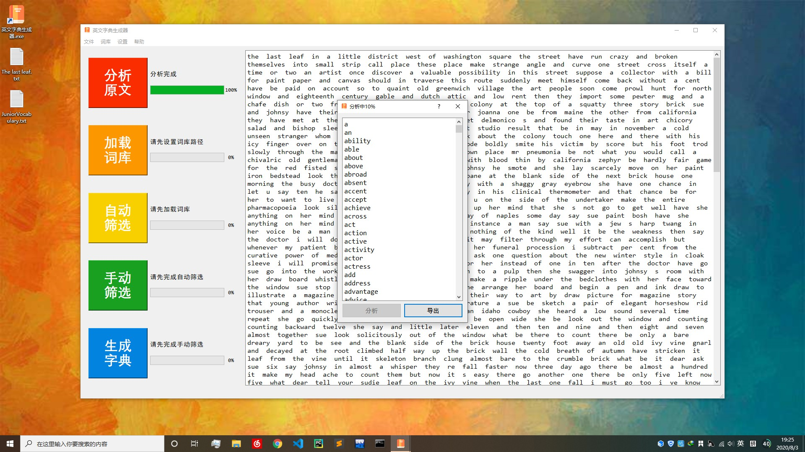

词库制作完成后，我们要设置词库路径，请参见上文2.2.3.1路径设置设置好词库路径

下次打开软件时，词库路径会默认为我们现在设置的路径

路径设置完成后即可加载词库

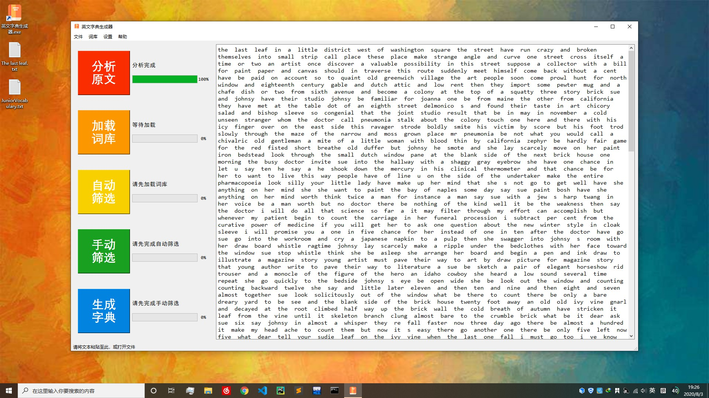

点击加载词库按钮即可进行加载

### 3.5自动筛选

词库加载完成后，点击自动筛选以进行基于已加载词库的自动筛选

### 3.6手动筛选

自动筛选完成后，点击手动筛选以进行更为精细的筛选

更多手动筛选的细节请参照上文2.1.4手动筛选、2.2.3.2模式设置

如下图，我们勾出不需要的单词

勾选完成后，关闭手动筛选窗口以保存结果

### 3.7生成字典

若打开了检查模式，则会在制作前进行检查(参见2.1.5.1生成字典前检查)

由于软件设计了对已查单词进行保存(未写入文件，软件关闭后即消失)，故检查能提升制作速度，且连续制作时检查速度也能有所提升

生成字典时有两种模式选择，具体参见上文2.1.5.2无页码生成模式，2.1.5.3有页码生成模式，2.2.3.2模式设置

在这里我们暂且使用无页码生成模式，制作完成后结果如下:

可以看到，得到的字典并没有目录和页眉页脚，并不是非常完整，但速度较快

使用有页码生成模式请参见上文2.1.5.3有页码生成模式

另外，在进行有页码生成模式时，保存路径请不要带有空格；请不要点击鼠标。软件设计了调用系统自带的Word对文本进行相应的检测，此时系统自带的Word正在隐式的运行，点击鼠标会使其变得显式；倘若不慎点击，请将弹出的激活向导、欢迎页面等阻碍Word正常运行的窗口关闭即可，但不要关闭Word文档，否则会导致制作终止。在制作过程中，也请不要关闭软件，否则下次制作时会引发错误，解决方法时打开任务管理器，终止掉系统自带Word在后台的进程。请不要在制作过程中打开正在制作的文档，这样也会引发错误。

在有页码生成模式制作完成后，会进行页码添加操作，若文件过大，程序窗口可能会卡顿，请不要用鼠标去点击卡顿的程序窗口，会引发程序崩溃。

### 3.8打印字典

字典生成后，可根据个人喜好将其打印。

建议将其打印为小册子，方便随时携带与翻阅。